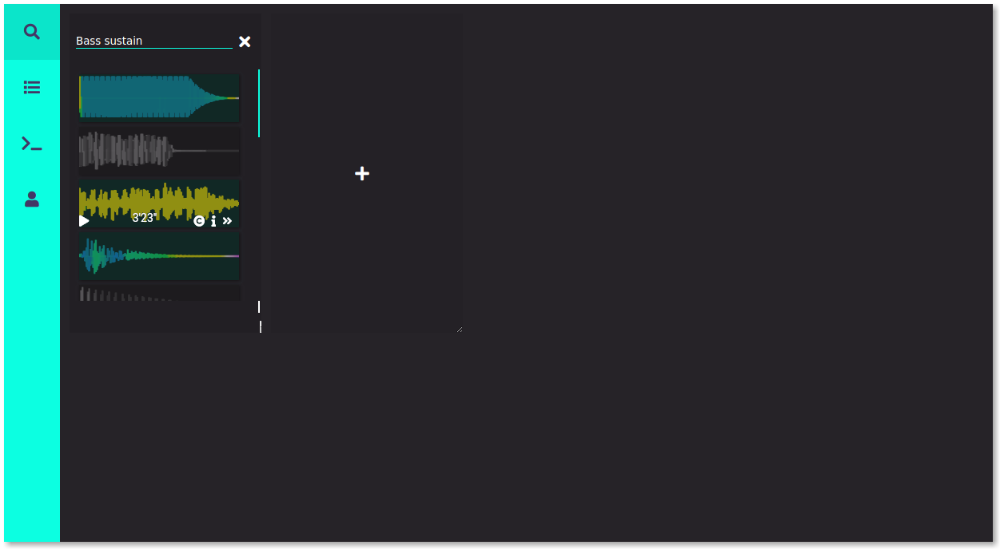
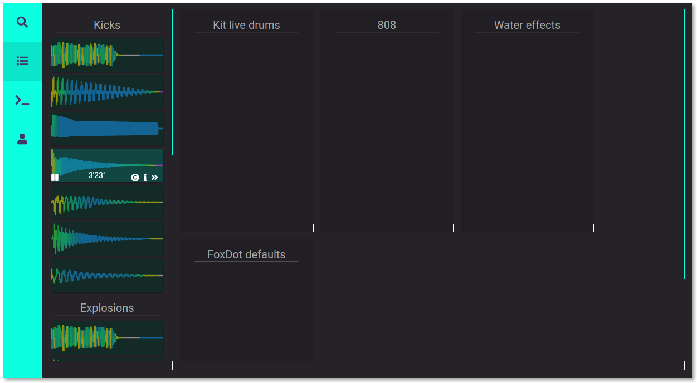

# Sound library
(NOTHING WORKING HERE, just experiments for now)
Freesound desktop client with FoxDot integration, usable to create sound kits.

This software should help you organize and take with you on different setups your sounds library.
Sound samples are taken from freesound.org and organized in `kits` tied to the freesound.org account.
I plan on doing this by "abusing" the `bookmarks` feature of freesound.org, creating bookmarks with
a recognizable syntax to keep the `kit` information on freesound servers without having to rely on an
external service for this.

It should also integrate with [FoxDot](https://github.com/Qirky/FoxDot) by allowing to build kits
of samples represented by a character, so that you can easily swap sound kits in FoxDot before a live session.

More in general, it should be able to export soundkits to the filesystem, with licenses and needed credits, to be used
elsewhere.

## UI Prototype
I started working on the ui using react to prototype it.
Here how it looks like at the moment:

I'm now working on impelmenting it in QML, so I can drop javascript and work with python (pyside2) or c++ (QT itself).
